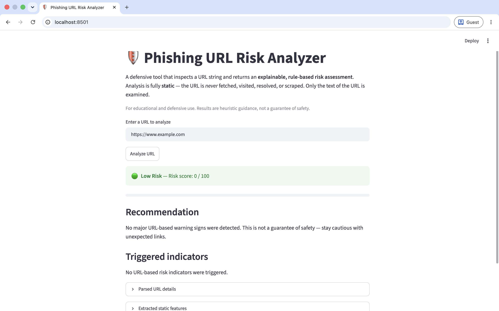
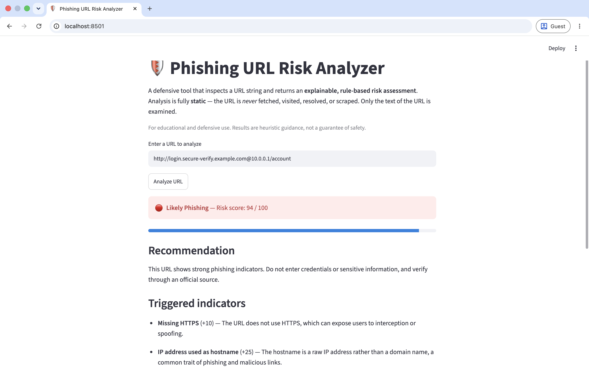
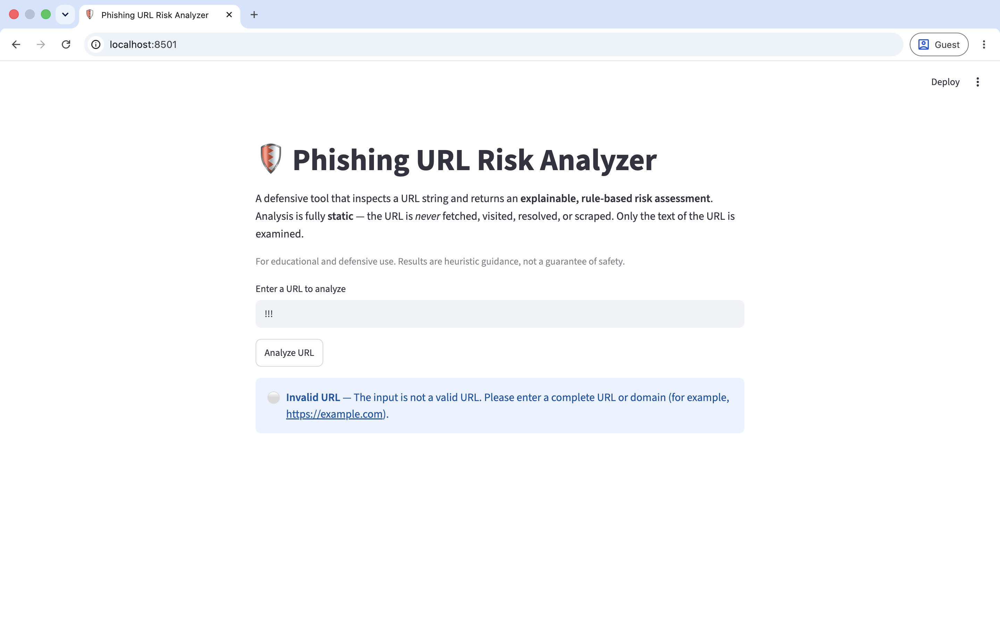

# 🛡️ Phishing URL Risk Analyzer

> **Status: ✅ All milestones complete (0–5).** A local, explainable, rule-based
> tool for assessing the risk of a URL from its structure alone. Runs locally
> via a Streamlit UI or from Python. Not deployed.

A defensive cybersecurity tool that analyzes a URL string and returns an
**explainable, URL-based risk assessment** — classifying it as *Low Risk*,
*Suspicious*, or *Likely Phishing* using transparent, rule-based indicators.

Every point in the score is traceable to a documented rule with a plain-language
explanation, so the result is auditable rather than a black box.

---

## What this tool is (and is not)

**It is:** a static analyzer of URL *strings*. It inspects the text of a URL —
scheme, hostname, subdomains, characters, keywords, length — and applies
transparent heuristics.

**It is not:** a live scanner, a threat-intelligence feed, or a machine-learning
classifier. It **does not fetch, visit, resolve, or scrape** any URL, and it
performs **no DNS lookups or network requests** of any kind. It **cannot
determine whether a website is actually safe or malicious** — it only flags
structural warning signs commonly associated with phishing links.

## Screenshots

> 📸 **Add real screenshots before publishing.** Capture them by running the app
> (`streamlit run app.py`) and save them to the `screenshots/` folder using the
> exact filenames below. Until you add the files, these image links will not
> render on GitHub. Do **not** commit placeholder or fabricated images.

**Low-risk result**



**Likely-phishing result**



**Invalid URL**



## Current functionality

The tool can, entirely offline:

1. **Safely parse** a raw URL string into structured components (`parse_url`).
2. **Extract static indicators** from the parsed result (`extract_features`) —
   lengths, character counts, subdomain count, IP/localhost hosts, ports,
   queries, fragments, `@` symbols, and suspicious keywords.
3. **Produce an explainable risk score** (`score_url`) — a numeric score, a
   risk label, the triggered indicators (each with points and an explanation),
   and a safety recommendation.
4. **Present results in a local Streamlit UI** (`app.py`).

All analysis is **static string analysis only**. No fetching, visiting,
resolving, or scraping of URLs occurs at any layer.

## Implemented features

- [x] Safe, offline URL parsing into structured components
- [x] Hostname syntax validation (IP / `localhost` / valid domain labels)
- [x] Static URL indicator extraction
- [x] Transparent, weighted, rule-based risk scoring (capped at 100)
- [x] Human-readable explanation for every triggered indicator
- [x] Risk classification: *Low Risk*, *Suspicious*, *Likely Phishing*, *Invalid URL*
- [x] Safety recommendation per result
- [x] Local Streamlit web interface
- [x] Unit test suite (39 tests)

## Tech stack

| Area              | Tool                                  |
| ----------------- | ------------------------------------- |
| Language          | Python 3.11+                          |
| URL parsing       | `urllib` (standard library)           |
| Domain parsing    | `tldextract`                          |
| Hostname / IP     | `ipaddress`, `re` (standard library)  |
| UI                | `streamlit`                           |
| Testing           | `pytest`                              |
| Version control   | Git + GitHub                          |

No machine learning, no external APIs, no network dependencies at runtime.

## Project structure

```text
phishing-url-risk-analyzer/
├── app.py                          # Streamlit UI (entry point)
├── src/
│   └── phishing_url_analyzer/
│       ├── __init__.py
│       ├── parser.py               # parse_url()      — safe URL parsing
│       ├── features.py             # extract_features() — static indicators
│       └── scorer.py               # score_url()      — explainable scoring
├── tests/
│   ├── __init__.py
│   ├── test_parser.py
│   ├── test_features.py
│   └── test_scorer.py
├── docs/
│   └── scoring-rules.md            # Scoring reference
├── screenshots/                    # Real UI screenshots (add your own)
├── data/
├── requirements.txt
├── pyproject.toml                  # pytest configuration (src layout)
├── .gitignore
├── .env.example
├── LICENSE
└── README.md
```

## Setup

```bash
# Clone
git clone https://github.com/<your-username>/phishing-url-risk-analyzer.git
cd phishing-url-risk-analyzer

# Create and activate a virtual environment
python3 -m venv .venv
source .venv/bin/activate          # macOS/Linux
# .venv\Scripts\activate           # Windows (PowerShell)

# Install dependencies
pip install -r requirements.txt
```

## Run the local app

```bash
streamlit run app.py
```

Streamlit opens the app in your browser (default: http://localhost:8501). Enter
a URL, click **Analyze URL**, and review the result. The app runs entirely
locally and makes no outbound network requests.

## Usage from Python

The package uses a `src/` layout, so put `src/` on your path when importing
outside of pytest:

```bash
PYTHONPATH=src python your_script.py
```

```python
from phishing_url_analyzer.scorer import score_url

result = score_url("http://login.secure-verify.example.com@10.0.0.1/account")

print(result["risk_label"])   # "Likely Phishing"
print(result["risk_score"])   # 94

for indicator in result["triggered_indicators"]:
    print(f"+{indicator['points']:>3}  {indicator['name']}")
    print(f"       {indicator['explanation']}")

print(result["recommendation"])
```

The returned dict also preserves all parsed fields and the nested `features`
dictionary, so you can inspect the underlying indicators directly.

## Example inputs and outputs

These reflect the current scoring behaviour:

| Example URL | Expected label | Why |
| --- | --- | --- |
| `https://www.example.com` | `Low Risk` | No major static warning signs |
| `http://example.com` | `Low Risk` | Missing HTTPS only (+10) |
| `http://user@evil.example.com/home` | `Suspicious` | Missing HTTPS + `@` symbol (35) |
| `http://login.secure-verify.example.com@10.0.0.1/account` | `Likely Phishing` | Multiple strong indicators (94) |
| `!!!` | `Invalid URL` | Invalid hostname syntax |

## Scoring rules and risk labels

Risk labels are assigned from the capped score:

| Score range | Label |
| ----------- | ----- |
| 0–24        | Low Risk |
| 25–59       | Suspicious |
| 60–100      | Likely Phishing |
| —           | Invalid URL (blank or structurally invalid input) |

Indicator weights (each traceable in `scorer.py`):

| Indicator | Points |
| --------- | ------ |
| Missing HTTPS | +10 |
| IP address used as hostname | +25 |
| localhost / internal-style hostname | +10 |
| Explicit port | +8 |
| `@` symbol in URL | +25 |
| Suspicious keyword | +8 each, capped at +24 |
| Excessive URL length (> 100) | +15 |
| Many subdomains (≥ 3) | +15 |
| Many dots (≥ 5) | +10 |
| Many hyphens (≥ 4) | +10 |
| Query string present | +5 |
| Fragment present | +3 |

The total is **capped at 100**. Invalid or blank input is always reported as
`Invalid URL` with a score of 0 — never as phishing. See
[`docs/scoring-rules.md`](docs/scoring-rules.md) for full details.

## Testing

```bash
pytest
pytest -W error::DeprecationWarning
```

Both should report **39 passed**. The second command promotes any
`DeprecationWarning` to a failure, confirming no deprecated APIs are in use.

## Roadmap

| Milestone | Goal                                             | Status      |
| --------- | ------------------------------------------------ | ----------- |
| 0         | Project setup, structure, and documentation      | ✅ Complete |
| 1         | Safe URL parsing into structured components       | ✅ Complete |
| 2         | URL feature / indicator extraction                | ✅ Complete |
| 3         | Explainable, weighted risk scoring                | ✅ Complete |
| 4         | Streamlit UI                                      | ✅ Complete |
| 5         | Portfolio polish and documentation                | ✅ Complete |

## Limitations

This is a heuristic, educational tool. Its limitations are important:

- **Static string analysis only.** It never inspects page content, certificates,
  redirects, DNS records, or reputation data. A URL can look benign here and
  still be malicious, and vice versa.
- **Heuristic weights are illustrative,** not empirically tuned against a
  labelled dataset. Scores indicate relative suspicion, not probability.
- **Keyword matching is naive** (case-insensitive substring). Legitimate URLs
  containing words like `login` or `account` will accumulate points and may be
  flagged as suspicious (false positives).
- **Some valid uses are penalised** — e.g. explicit ports, IP hosts, or
  `localhost` are normal in development but treated as risk signals.
- **No internationalised / homoglyph / punycode analysis,** and the keyword list
  is English-only.
- **It cannot confirm safety or maliciousness.** Treat results as guidance to
  complement, not replace, careful judgement and proper security controls.

## Disclaimer

This tool is for **educational and defensive** purposes only. It performs static
analysis of URL strings and does not fetch, visit, resolve, or interact with any
URL or host. It provides heuristic guidance and must not be relied upon as the
sole basis for security decisions. It is not deployed and is not intended for
production use.

## License

Released under the [MIT License](LICENSE).